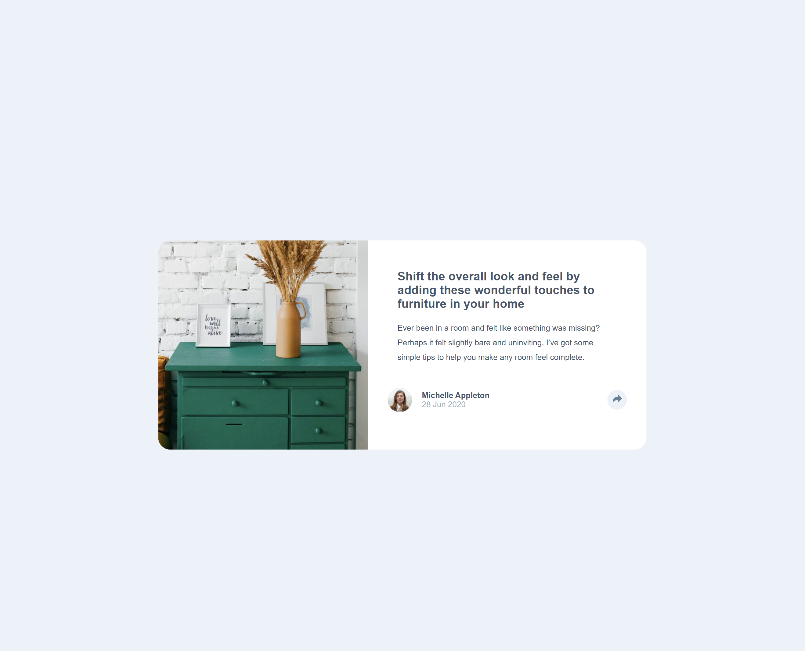

# Frontend Mentor - Article preview component solution

This is a solution to the [Article preview component challenge on Frontend Mentor](https://www.frontendmentor.io/challenges/article-preview-component-dYBN_pYFT). Frontend Mentor challenges help you improve your coding skills by building realistic projects. 

## Table of contents

- [Frontend Mentor - Article preview component solution](#frontend-mentor---article-preview-component-solution)
  - [Table of contents](#table-of-contents)
  - [Overview](#overview)
    - [The challenge](#the-challenge)
    - [Screenshot](#screenshot)
    - [Links](#links)
  - [My process](#my-process)
    - [Built with](#built-with)
    - [What I learned](#what-i-learned)
    - [Continued development](#continued-development)
    - [Useful resources](#useful-resources)
  - [Author](#author)

**Note: Delete this note and update the table of contents based on what sections you keep.**

## Overview

### The challenge

Users should be able to:

- View the optimal layout for the component depending on their device's screen size
- See the social media share links when they click the share icon

### Screenshot

### Links

- Solution URL: [article preview component - github](https://github.com/Charlie025x/article-preview-component-react.js)
- Live Site URL: [article preview component - gh pages](https://charlie025x.github.io/article-preview-component-react.js/)

## My process

### Built with

- Semantic HTML5 markup
- CSS custom properties
- Flexbox
- Mobile-first workflow
- [React](https://reactjs.org/) - JS library
- [SCSS](https://sass-lang.com/) - Style sheet language

### What I learned

I've followed a few react tutorials, but this is my first project away from a tutorial.  With this project, I learned a few things about react. I learned React is more strict with html sintax you write than what browsers expect out of a vanilla html file, how to toggle a class or component, and how to deploy my project using gh-pages. 

### Continued development

I wish to continue using state and props to gain a deeper understanding of them so that I can choose when it's appropriate to use either one. Another thing I want to work on is getting better at picking what html jsx code should be made to a component.

### Useful resources

- [How to Show and Hide ReactJS Components, pluralsight.com](https://www.pluralsight.com/guides/how-to-show-and-hide-reactjs-components) - This article really helped me make my solution interactive. It showed me how to toggle an html div to hide and show, then how to toggle that same div in the form of a component using react.
- [How to toggle a class in React](https://reactgo.com/react-toggle-class/) - Similar to the resorce above, this article showed me how to toggle a class using react.

## Author

- Frontend Mentor - [@Charlie025x](https://www.frontendmentor.io/profile/Charlie025x)
